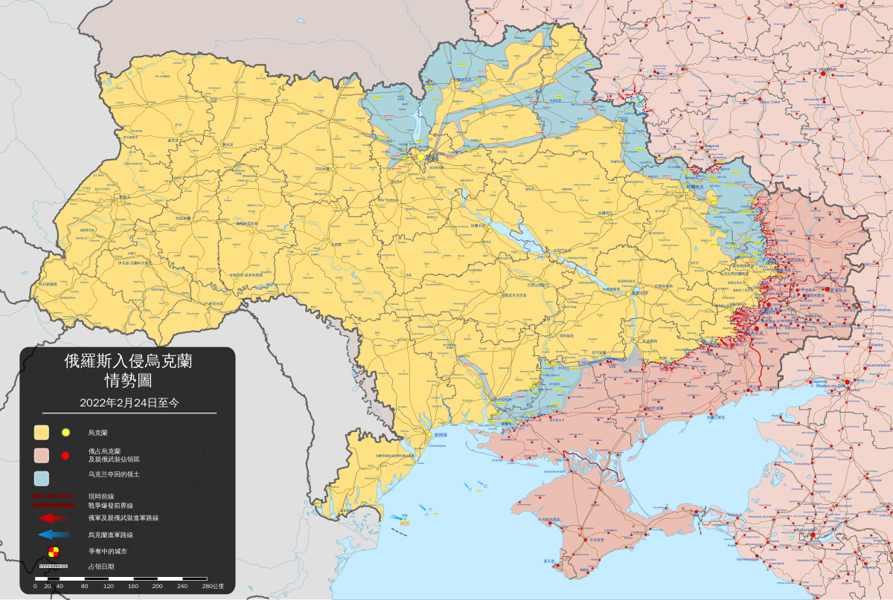

<!DOCTYPE html>

<html lang="zh-CN">

<head>

    <meta charset="UTF-8">

    <meta name="viewport" content="width=device-width, initial-scale=1.0">

    <title>俄乌战争历史根源</title>

    

</head>

<body>

    <h1>摘要</h1>

    
本论文探讨了俄乌战争的历史根源，分析了民族认同、领土争端和地缘政治因素如何推动冲突的爆发。通过回顾俄罗斯与乌克兰的历史关系，论文指出，克里米亚(Crimea)问题和北约(NATO)东扩是直接触发冲突的关键因素。同时，普京提出的“历史统一”理论表明，俄罗斯将乌克兰视为其历史和地缘政治的一部分。文章还分析了俄罗斯通过军事干预和政治施压，试图恢复其在后苏联地区的影响力。

    
结论认为，俄乌战争是多种历史、文化和地缘政治因素交织的结果。

  

    <h1>一、论文背景</h1>

    
俄乌战争，始于2014年的克里米亚危机，并在随后的冲突中不断升级，已经成为21世纪初最具深远影响的国际事件之一。这场战争不仅仅是乌克兰与俄罗斯之间的对抗，更是全球大国间的地缘政治博弈的缩影。在战争爆发前，乌克兰在亲西方与亲俄势力之间摇摆不定，这一矛盾加剧了俄罗斯与西方之间的紧张关系。俄罗斯的行动，尤其是对克里米亚的吞并及对东乌克兰亲俄武装的支持，突显了俄罗斯对其传统势力范围的强烈需求，以及对失去的地缘战略空间的深刻焦虑。

    
俄乌战争不仅是两国间的局部冲突，更是全球政治格局的重要组成部分。冷战结束后，俄罗斯与西方国家的关系经历了从合作到对抗的剧烈变化，尤其是俄罗斯对于北约东扩的反应，反映出俄罗斯对失去影响力的恐惧与对国际秩序变动的反应。随着战争的持续，冲突范围已不仅限于军事领域，信息战、经济制裁以及能源博弈等多维度的非传统手段也成为了这一战争的重要组成部分。

    

    
本文旨在探讨俄乌战争的历史原因，特别是在民族问题、领土争端、地缘政治等方面的复杂背景，揭示战争爆发的深层次原因。

  

    <h1>二、民族问题</h1>

    

        

            <table style="width: 45%; border-collapse: collapse; text-align: left;">

            <tbody><tr>

            <th style="border: 1px solid #000; padding: 8px;">乌克兰民族构成</th>

            <th style="border: 1px solid #000; padding: 8px;">比例（%）</th>

            </tr>

            <tr>

            <td style="border: 1px solid #000; padding: 8px;">乌克兰族</td>

            <td style="border: 1px solid #000; padding: 8px;">77.8</td>

            </tr>

            <tr>

            <td style="border: 1px solid #000; padding: 8px;">俄罗斯族</td>

            <td style="border: 1px solid #000; padding: 8px;">17.3</td>

            </tr>

            <tr>

            <td style="border: 1px solid #000; padding: 8px;">罗马尼亚族和摩尔多瓦族</td>

            <td style="border: 1px solid #000; padding: 8px;">0.8</td>

            </tr>

            <tr>

            <td style="border: 1px solid #000; padding: 8px;">白俄罗斯族</td>

            <td style="border: 1px solid #000; padding: 8px;">0.6</td>

            </tr>

            <tr>

            <td style="border: 1px solid #000; padding: 8px;">克里米亚鞑靼人</td>

            <td style="border: 1px solid #000; padding: 8px;">0.5</td>

            </tr>

            <tr>

            <td style="border: 1px solid #000; padding: 8px;">保加利亚族</td>

            <td style="border: 1px solid #000; padding: 8px;">0.4</td>

            </tr>

            <tr>

            <td style="border: 1px solid #000; padding: 8px;">匈牙利族</td>

            <td style="border: 1px solid #000; padding: 8px;">0.3</td>

            </tr>

            <tr>

            <td style="border: 1px solid #000; padding: 8px;">波兰族</td>

            <td style="border: 1px solid #000; padding: 8px;">0.3</td>

            </tr>

            <tr>

            <td style="border: 1px solid #000; padding: 8px;">其他</td>

            <td style="border: 1px solid #000; padding: 8px;">1.7</td>

            </tr>

            </tbody></table>

            <table style="width: 45%; border-collapse: collapse; text-align: left;">

            <tbody><tr>

            <th style="border: 1px solid #000; padding: 8px;">俄罗斯民族构成</th>

            <th style="border: 1px solid #000; padding: 8px;">比例 (%)</th>

            </tr>

            <tr>

            <td style="border: 1px solid #000; padding: 8px;">俄罗斯族</td>

            <td style="border: 1px solid #000; padding: 8px;">77.00</td>

            </tr>

            <tr>

            <td style="border: 1px solid #000; padding: 8px;">鞑靼族</td>

            <td style="border: 1px solid #000; padding: 8px;">3.83</td>

            </tr>

            <tr>

            <td style="border: 1px solid #000; padding: 8px;">乌克兰族</td>

            <td style="border: 1px solid #000; padding: 8px;">2.03</td>

            </tr>

            <tr>

            <td style="border: 1px solid #000; padding: 8px;">巴什基尔族</td>

            <td style="border: 1px solid #000; padding: 8px;">1.15</td>

            </tr>

            <tr>

            <td style="border: 1px solid #000; padding: 8px;">楚瓦什族</td>

            <td style="border: 1px solid #000; padding: 8px;">1.13</td>

            </tr>

            <tr>

            <td style="border: 1px solid #000; padding: 8px;">车臣族</td>

            <td style="border: 1px solid #000; padding: 8px;">0.94</td>

            </tr>

            <tr>

            <td style="border: 1px solid #000; padding: 8px;">亚美尼亚族</td>

            <td style="border: 1px solid #000; padding: 8px;">0.78</td>

            </tr>

            <tr>

            <td style="border: 1px solid #000; padding: 8px;">莫尔多瓦族</td>

            <td style="border: 1px solid #000; padding: 8px;">0.58</td>

            </tr>

            <tr>

            <td style="border: 1px solid #000; padding: 8px;">其他</td>

            <td style="border: 1px solid #000; padding: 8px;">12.56</td>

            </tr>

            </tbody></table>

            

    

    
俄罗斯、白俄罗斯和乌克兰在历史上源自基辅罗斯，三者同为东斯拉夫民族，具有共同的文化和语言根基。然而，随着时间的推移，乌克兰逐渐形成了独特的民族认同，并且与俄罗斯的“大俄罗斯”概念发生了分歧。基辅罗斯，作为中世纪时期的东斯拉夫国家，其疆域涵盖了今天的俄罗斯、乌克兰和白俄罗斯。虽然这三个国家在语言、宗教和文化上有许多相似之处，但民族认同的差异逐渐显现，尤其是在苏联解体之后。

    
在 19 世纪和 20 世纪，乌克兰地区长期处于俄罗斯帝国和奥匈帝国的控制之下。在这一过程中，乌克兰的民族认同逐渐趋向于独立性，尤其是在语言和文化领域。在苏联时期，乌克兰的“乌克兰化”政策（即加强乌克兰文化和语言的推广）进一步推动了乌克兰与俄罗斯之间的文化差异。在这一背景下，乌克兰的民族主义逐渐崛起，尤其是在西部地区，乌克兰人民对俄罗斯的统治产生了强烈的不满。苏联解体后，乌克兰宣告独立，进一步加剧了与俄罗斯的分歧。俄罗斯则一直视乌克兰为“历史上不可分割的一部分”，认为乌克兰的独立性挑战了俄罗斯的历史和地缘政治利益。

    
此外，乌克兰国内的民族分裂也加剧了两国的矛盾。乌克兰东部和南部地区，尤其是顿巴斯 (Donbas) 和克里米亚，长期存在较为强烈的亲俄情绪。这里的俄罗斯族群占据主导地位，且与俄罗斯保持密切的文化和经济联系。反观西部地区，尤其是利沃夫和基辅 (Kyiv)，受到了欧洲文化的较大影响，亲西方情绪更为浓厚。正是这种东西部的民族分裂，加剧了乌克兰国内的政治动荡，并成为俄罗斯在乌克兰实施干预的一个重要因素。

  

    <h1>三、克里米亚问题</h1>

    
克里米亚是俄乌战争中的关键争议点。克里米亚的历史可追溯到古代，其地理位置位于黑海与亚速海之间，具有重要的战略意义。1954 年，苏联 (Soviet Union) 领导人赫鲁晓夫将克里米亚划归乌克兰，然而这一举措并未能消除克里米亚地区俄罗斯族群的忧虑。尽管克里米亚在苏联时期属于乌克兰的一部分，但该地区的俄罗斯族群始终对乌克兰的主权提出异议，并与乌克兰政府发生冲突。在苏联解体后，克里米亚的民族认同问题愈加突出。俄罗斯族群认为自己与俄罗斯有更为紧密的历史和文化联系，认为克里米亚应该归俄罗斯所有。

    
2014 年，俄罗斯通过军事干预占领克里米亚，随后举行公投，宣布克里米亚并入俄罗斯。然而，国际社会普遍未承认这一行动，认为俄罗斯对乌克兰领土的吞并违反了国际法。克里米亚的争夺不仅涉及领土问题，也涉及民族认同和文化归属问题。俄罗斯认为克里米亚是其历史的一部分，认为克里米亚的俄罗斯族群应有权决定自己的命运；而乌克兰则认为克里米亚是乌克兰的一部分，俄罗斯的军事介入是对乌克兰主权的侵犯。

    
克里米亚问题的争议背后，反映的是俄罗斯与乌克兰对历史和文化的不同解读。俄罗斯视克里米亚为其历史和文化的延续，认为克里米亚的归属问题是俄罗斯民族复兴的一部分；而乌克兰则认为克里米亚是其领土的一部分，俄罗斯的吞并行为是对乌克兰民族独立性的挑战。

  

    <h1>四、北约东扩</h1>

    

    
冷战结束后，俄罗斯与西方国家的关系经历了剧烈变化。特别是随着苏联解体和东欧剧变，北约逐步东扩，接纳了多个前苏联卫星国，如波兰、捷克和波罗的海国家。这一过程引发了俄罗斯的强烈反应。俄罗斯将北约的东扩视为对其国家安全的直接威胁，认为这一举措削弱了俄罗斯在欧洲的战略地位。俄罗斯的安全政策和外交战略逐渐转向强硬，以确保其在欧洲的影响力。

    
乌克兰地处俄罗斯与西方之间的战略缓冲区，是俄罗斯与西方博弈的前沿。冷战结束后，乌克兰在亲西方和亲俄势力之间摇摆不定，导致了国内的政治不稳定。尤其是在 2004 年的“橙色革命 (Orange Revolution)”后，亲西方的势力逐渐上升，这让俄罗斯感到深深的不安。俄罗斯认为，如果乌克兰加入北约，不仅会削弱俄罗斯的战略地位，还可能引发对俄罗斯安全的直接威胁。因此，俄罗斯采取了一系列外交、经济和军事手段，试图阻止乌克兰靠近西方，尤其是加入北约。

    
北约的东扩和乌克兰的亲西方政策被俄罗斯视为“西方围堵”的一部分。俄罗斯认为，乌克兰的西向倾斜意味着其失去了对该国的影响力，进一步削弱了俄罗斯在地区的主导地位。这一担忧使得俄罗斯在应对乌克兰问题时采取了激进的立场，特别是在 2014 年吞并克里米亚和支持东乌克兰亲俄武装时，俄罗斯的行动显然是为了阻止乌克兰进一步向西方靠拢，维持其在该地区的影响力。

  

    <h1>五、俄罗斯扩张主义</h1>

    
在这篇文章中，普京明确提出，俄罗斯人、乌克兰人以及白俄罗斯人实际上是同一个民族，属于“历史上被称为‘三位一体的俄罗斯人’的民族”。他认为，俄罗斯和乌克兰有着共同的渊源和命运，这种文化、语言和历史上的紧密联系使得两国之间不应存在根本的分歧。普京进一步强调，乌克兰的独立性是后苏联时期的一种不自然状态，且这种状态是由外部势力和苏联时期的政治决策所造成的。

    
虽然普京在一些协议中曾间接承认乌克兰的独立（如在布达佩斯安全保障备忘录中），但在该文章中，他公开否认了乌克兰作为一个独立国家的合法性，认为乌克兰的边界和民族身份不应当独立存在。普京指出，乌克兰境内有大量俄罗斯族人，他认为“形成一个对俄罗斯具有敌意的纯乌克兰民族国家”不仅是不可能的，而且是对俄罗斯的威胁，类似于对俄罗斯进行大规模的政治和文化攻击。

    
普京还公开质疑乌克兰的边界，称乌克兰目前的领土是“自古以来属于俄罗斯的土地”，并将当前的边界划定视为外部势力干预和苏联时期的政治决定所造成的历史产物。他特别提到，顿巴斯地区的冲突可以被理解为基辅政府对该地区的忽视，认为基辅“根本不需要顿巴斯”，进一步表明俄罗斯对乌克兰内政的干预是基于其地缘政治利益。

    
普京认为，当前的危机不仅仅是乌克兰内部问题的结果，而是西方国家对俄罗斯的敌对行为和反俄势力推动的结果。他指责乌克兰政府受西方干预和极端民族主义力量的影响，尤其是“班杰拉的追随者”，并将这一政治风潮归咎于西方反俄阴谋。基于这些观点，普京主张俄罗斯必须在乌克兰事务中占有重要一席之地，且有责任干预乌克兰的政治未来。

    
普京的这一系列观点和论述，表明了俄罗斯在乌克兰问题上的强硬立场，也反映出他通过历史和民族主义叙事强化对乌克兰的政治控制和影响力。他通过强调两国“共同的历史”和“不可分割的命运”，提出恢复“历史统一”的目标，试图将乌克兰纳入俄罗斯的势力范围，并通过军事干预等方式推动这一战略目标的实现。

  

    <h1>六、总结</h1>

    
俄乌战争的爆发不仅仅是由一系列偶发的政治事件所引发，而是深植于俄乌两国数百年复杂的历史背景、民族认同的冲突以及地缘政治博弈之中。通过对战争起源的历史分析，可以更清楚地看到，这场冲突不仅仅是乌克兰和俄罗斯之间的对抗，它也是全球大国竞争、民族主义复兴以及冷战后国际秩序转型的一部分，揭示了国与国之间在历史、文化、战略利益等方面的深层次矛盾。这场战争的解决不仅依赖于乌克兰自身的政治和社会稳定，也取决于俄罗斯在经济、外交和军事方面如何找到一种新的平衡。

  

    <h1>参考文献</h1>

    <ul>

        <li>《克里米亚战争》，Orlando Figes，2018，南京大学出版社</li>

        <li>《大国战略：世界是如何被统治的》，Pedro Baños，2021，浙江人民出版社出版</li>

        <li>《零年：1945——现代世界诞生的时刻》，伊恩·布鲁玛，2019，北京日报出版社</li>

        <li>《论俄罗斯人和乌克兰人的历史统一》，弗拉基米尔·普京，2021，kremlin.ru</li>

    </ul>

</body>

</html>